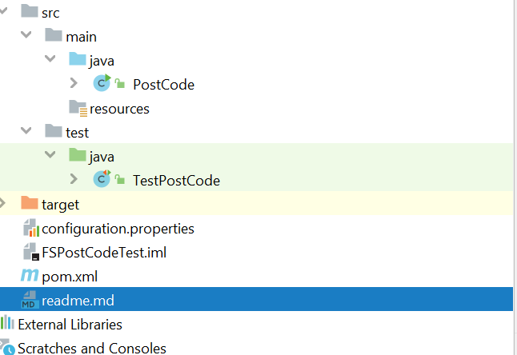
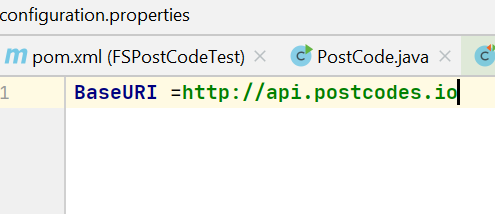
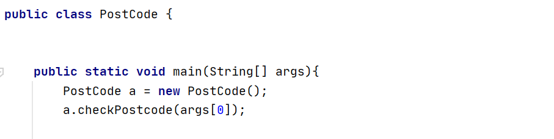
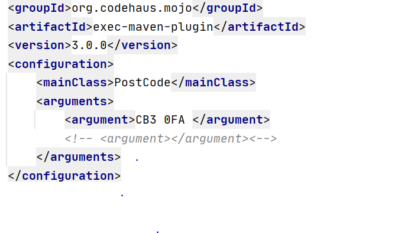
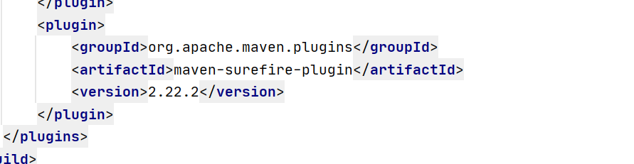

 # Feature Space Post Code Test Project
 
 ##Introduction
Name| XXXXXXXXXXX
---------------|-------------
Project| Featurespace Coding Test - Java
REST API used| http://postcodes.io
Build Tool|Maven


###Purpose
This project uses Java to query a  JSON Formatted REST API for a UK Postcode and list nearby Postcodes.
 The Java code is then tested through Unit Tests.

######Project Requirements: 
    • Your application should accept a postcode as an argument to its main() method.
    • It should query the API to:
        ◦ Validate the postcode parameter – invalid postcodes should produce an error message
        ◦ Print the country and region for that postcode.
        ◦ Print a list of the nearest postcodes, and their countries and regions.
        Please add some unit tests - don’t go overboard, but show us an example or two of some edge cases or things that could go wrong.


######Implementation

A JavaClass for looking up postcodes through the API was created along with a TestClass for Unit Tests. 


In the configuration properties file it is possible to set the BaseURI


As requirement is to create a main method which can accept a postcode, under the Class Postcode a main method was created. 


As per Feedback also set up POJO classes and validated our input through command line. 

Through Exec Maven Plugin, we can ensure it will receive a postcode through command line and thus updated the POM.xml file.

 


Further Postcodes can be added under the argument section if needed. 

As Tests were required, Maven Surefire Plugin was added in order to run the tests. 


As the Testclass begins with Test, Maven automatically detects it when using the maven command, 
so no need to add a Maven goal at this point. 
However, it can be added later on if required.


### Installation Guide
As its Maven project, its assumed that the host has Maven as well as JAVA_HOME installed on their machine. 
Here is a link for Maven Installation if needed: 
https://maven.apache.org/install.html

##### Dependencies 
The following dependencies are used:
* JUnit
* Jupiter API
* Jupiter engine
* Gson
* REST Assured
* Exec Maven Plugin
* Maven Surefire Plugin
#### Build and Run your Project
 
 As its a Maven Project, use the following commands to run the application:
 
````
 mvn clean compile exec:java
````
or if you want to test a postcode from command line use : 
``````
mvn exec:java -Dexec.mainClass=test.Postcode -Dexec.args="'yourpostcode' 'yourpostcode'"
````````````````
In order to run the tests, use the following maven commands:
````
 mvn clean test
````


 


